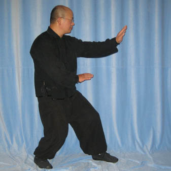

This is the basic stance for the classroom.

## Footwork
Footwork is on 45 degrees position. Not too wide and not too close to make a stable stance. Toes pointed to the attacker.

## Hands position
If the right leg is the front leg, the right hand should be at the face level. Not too close to the face and not too far too. The hand should be open and fingers together. The left hand should be close to the dantian. And vice-versa in case the left leg is the front leg.

## Tips and tricks
The important point for this stance is the weight: 60% on the back leg and 40% on the front leg. Knees should bent a little so the weight is better distributed.

