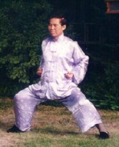

Horse stance is a stable stance. Used to improve endurance. It's a wide and stable stance as well.

## Footwork
Starting from [neutral](../neutral) open the legs wide, bend the knees, toes pointing forward.

## Hands position
Hands in form of punch, close to the ribs.

